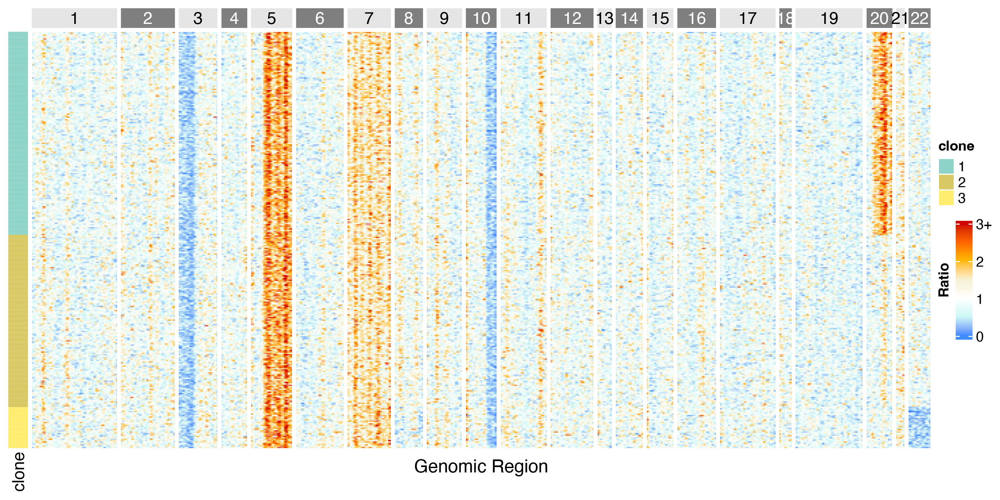
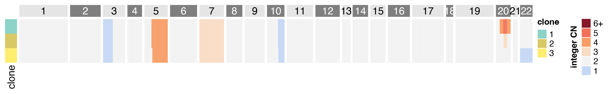
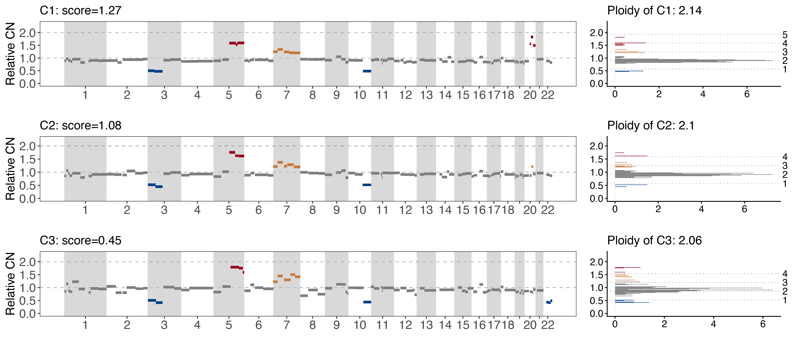

# TeaCNV: Tumor Epigenomic Absolute Copy Number Variation


## Description
TeaCNV is a computational framework designed to estimate tumor absolute copy number variations from single-cell chromatin accessibility data by aggregating the sparse signal of multi-individual cells to cell populations.
TeaCNV allows the inference of absolute copy number profiles from low coverage sparse data, including scATAC-seq and scATAC&RNA-seq co-assay data. 


## System requirements and dependency
This framework runs on R (version > 4.2.0)

## Installing
#### Option A: Install TeaCNV within R using devtools
If installing from directly within R, you can instead use the following command from within R.
```
library("devtools")
devtools::install_github("ShaojunLab/TeaCNV",build_opts = c("--no-staged-install"))
```
#### Option B: Install TeaCNV by pulling the code using git followed by source installation:
Alternatively, you can pull the code from github and install it:
```
git clone https://github.com/ShaojunLab/TeaCNV
cd TeaCNV
R
install.packages("./", repos=NULL, type="source",INSTALL_opts = c("--no-staged-install"))
```

## Usage

If TeaCNV is already installed, follow the steps below to set up the working directory. This step is essential if the user has not provided the necessary reference files, as TeaCNV's built-in reference data —defaulting to the HG38 genome version— is stored in the working directory. After setting up, you can load the sample data and run TeaCNV:

### Input
TeaCNV takes a peak-by-cell count matrix and a data table of cell annotation as input. 

Input files (demo: `/example/`):
- `atac_count.RData`: raw scATAC count matrix

						  cell1  cell2  cell3   ......
		chr1-9906-10568    0      1      2    ......
		chr1-16010-16366   2      0      1    ......


- `annotation.csv`: cell type annotation (e.g., observed, reference)

				     Cluster
		cell1      observed
		cell2      observed
		cell3      reference
		......     ...... 
  

#### Run TeaCNV on the demo dataset

```
library(TeaCNV)
#Download the 'example' folder to the current  work path
load("./example/atac_count.RData")
mtx <- as.matrix(mtx)
annotation <- read.csv("./example/annotation.csv",row.name=1)
```

Once the input data have been prepared, initialize a TeaCNV object to perform data preprocessing and quality control. Then run the main TeaCNV workflow to infer CNVs and identify subclonal structure.

```

cnv_obj <- CreateTeaCNVObject(input = mtx,
                             annotationFile = annotation,
                             ref_group_names = "reference",
                             ChrRemove = c('chrX', 'chrY', 'chrM'),
                             genome = "hg38",
                             count_lim = 4,
			     			 Correct_by_length = TRUE
)
res <- runTeaCNV(input_obj = cnv_obj,
	        outdir = "./example",
	        delt_lim = 0.3,
			min_cells_in_group = 20,
	        seu_resolution = 1)
```

#### Parameters:

- `annotationFile`: annotation data.
- `ref_group_names`: one or more group labels in annotation data, and cells assigned to these label(s) are treated as the normal/reference population for baseline normalization in downstream CNV inference.
- `count_lim`: filters out peaks with abnormally high counts; it is recommended to set this threshold to the 99th percentile of peak counts.
- `seu_resolution`: controls clustering granularity in **Seurat**; higher values (e.g., > 1.2) produce more clusters, while the default is 1.0.
- `min_cells_in_group`: sets the minimum number of cells required per clone; the default is 20. 
- `delt_lim`: defines the relative copy number (CN) ratio interval corresponding to a one-copy change in absolute CN (default: 0.4). Increasing `delt_lim` results in a lower estimated clonal-level ploidy.
- `Correct_by_length`: when set to `TRUE`, normalizes peak counts to counts per kilobase to account for varying peak lengths; set it to `FALSE` if the input matrix features (bins) are of equal length.


### Output files

The main TeaCNV results are saved in ‘final.CNVres.rds’, which contains the complete set of analysis outputs.

*Result object structure*

- **`cellinfo`** (`data.frame`, *n_cells × 2*): cell-level metadata  

		cellname clone
		cell1     1
		cell2     1
		cell3     2
		cell4     3
		......     ......

- **`clonalest`** (`list`, length = *n_clones*): clone-level CNV inference results  
  Each element (e.g., `clonalest[[1]]`) corresponds to one clone and includes:  
  - `input_BinSegRatio` (`data.frame`): bin-level ratios and segmentation annotations (bin coordinates, `binRatio`, `segID`, `SegMean`, segment stats, breakpoints, etc.)  
  - `seg.dat` (`data.frame`): segment-level CNV profile (chromosome, start/end, segment ratio, variance, weights, and inferred CN states such as `relativeCN` / `integerCN`)  
  - `CNest` (`data.frame`): mapping between ratio levels and inferred integer copy numbers  
  - `ploidy` (`numeric`): estimated clone-level ploidy  
  - `score` (`data.frame`): QC/fit metrics for CN estimation (e.g., MSE, segment fraction, aneuploidy score)  
  - `diploidy` (`logical`): whether the clone is inferred as diploid

- **`cellbinCount.norm`** (`matrix`, *n_bins × n_cells*): normalized bin counts (after length correction / normalization)  
- **`cellbinCount`** (`matrix`, *n_bins × n_cells*): raw bin counts  
- **`cellbinRatio_raw`** (`matrix`, *n_bins × n_cells*): raw bin-level ratio matrix before denoising  
- **`CNest.ref`** (`data.frame`): reference mapping from ratio to integer CN (global/reference-level CN calibration)  
- **`cellbinRatio_deNoise`** (`matrix`, *n_bins × n_cells*): denoised/smoothed bin-level ratio matrix used for CNV inference and visualization  

---


To adjust parameters and rerun the analysis, you can reload the intermediate object 'TeaCNV.obj' as `cnv_obj` and resume the workflow from that stage, without repeating the upstream preprocessing steps.

All figure outputs are saved to the `Figures/` directory. Key result plots include:

- 'heatmap_CNratio.pdf' — heatmap of (denoised) CN ratio signals across bins and cells/clones.


  
- 'heatmap_cloneCNV.pdf' — heatmap summarizing inferred integer CNV across clones.



- 'clonalCN_final_noDots.pdf' — final clone-level CNV profiles (segment-based CNV calls) across the genome.



For TeaCNV-related questions, refer to the README, FAQ, and publication. If something is unclear or missing, submit a Documentation Request or Feature Request on GitHub. For further assistance, contact us via email: Ying Wang [yingwang0727@outlook.com].


## SessionInfo
```r
R version 4.4.3 (2025-02-28)
Platform: x86_64-apple-darwin20
Running under: macOS Sequoia 15.4.1

locale:
[1] en_US.UTF-8/en_US.UTF-8/en_US.UTF-8/C/en_US.UTF-8/en_US.UTF-8

attached base packages:
[1] stats4    stats     graphics  grDevices utils     datasets  methods   base     

other attached packages:
[1] TeaCNV_0.1.0    ggplot2_3.5.2        data.table_1.17.6    GenomicRanges_1.58.0 GenomeInfoDb_1.42.3 
[6] IRanges_2.40.1       S4Vectors_0.44.0     BiocGenerics_0.52.0 

loaded via a namespace (and not attached):
 [1] vctrs_0.6.5             httr_1.4.7              cli_3.6.5               rlang_1.1.6             UCSC.utils_1.2.0       
 [6] generics_0.1.4          jsonlite_2.0.0          glue_1.8.0              scales_1.4.0            grid_4.4.3             
[11] tibble_3.2.1            lifecycle_1.0.4         compiler_4.4.3          dplyr_1.1.4             RColorBrewer_1.1-3     
[16] pkgconfig_2.0.3         XVector_0.46.0          rstudioapi_0.17.1       farver_2.1.2            R6_2.6.1               
[21] tidyselect_1.2.1        dichromat_2.0-0.1       pillar_1.10.2           GenomeInfoDbData_1.2.13 magrittr_2.0.3         
[26] withr_3.0.2             tools_4.4.3             gtable_0.3.6            zlibbioc_1.52.0   


